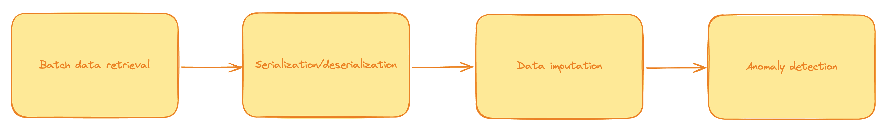
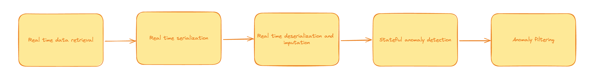

# Machine Learning with IoT data

In this repository, we will process IoT data containing air quality data from a sensor. We will use the River library to detect anomalies in the data.

We explore a two-fold approach, we first process the data in a batch manner, and then we process the data in a streaming manner.

Read the complete blog [here](https://bytewax.io/blog/batch-or-streaming-processing-for-iot-data)

## Running the notebooks

You can find Jupyter notebooks in the `notebooks` folder. You can run the notebooks in Google Colab by clicking on the links below:

[Batch version](https://colab.research.google.com/drive/1QzIxn5rbIfNE99Ykm9ApxfyF2ytjQxSL?usp=sharing)

[Streaming version](https://colab.research.google.com/drive/1775nLdTtEQQwZRw6PyB_lIh4hnhBhDh6?usp=sharing)

## Setting up the environment

If you prefer to run this locally, set up a virtual environment and install dependencies. For example with conda.

```bash
conda create -n iot-bytewax python=3.10
conda activate iot-bytewax
```

Then install the dependencies with pip.

```bash
pip install -r requirements.txt
```

## Batch processing

The steps for batch processing are as follows:



To run the batch version, run the following command:

```bash
cd src/dataprocessing_batch
python main.py
```

## Stream processing

The steps for streaming processing are as follows:



To run the streaming version, run the following command:

```bash
python -m bytewax.run dataflow:flow
```


